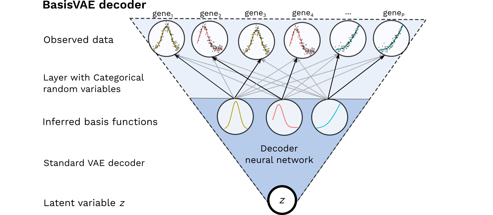

# BasisVAE

This is the PyTorch implementation of our AISTATS 2020 paper [**BasisVAE: Translation-invariant feature-level clustering with Variational Autoencoders**](https://arxiv.org/abs/2003.03462)


### Summary

It would be desirable to construct a joint modelling framework for simultaneous dimensionality reduction and clustering of features. Here, we focus on embedding such capabilities within the Variational Autoencoder (VAE) framework. Specifically, we propose the BasisVAE: a combination of the VAE and a probabilistic clustering prior, which lets us learn a one-hot basis function representation as part of the decoder network. This has been illustrated below.  Furthermore, for scenarios where not all features are aligned, we develop an extension to handle translation-invariant basis functions.



### Demo notebook

See [this Colab notebook](https://colab.research.google.com/drive/1q8rp3k4aAzog3rhsF2at76wysMSqddO5) for a toy example demo. 

### Implementation details

The core component of BasisVAE is its specialised decoder. See [decoder.py](https://github.com/kasparmartens/BasisVAE/blob/master/BasisVAE/decoder.py) for details about its usage and implementation. Our current implementation supports the following likelihoods `Gaussian, Bernoulli, NB, ZINB`. 

### Installation

```
pip install git+https://github.com/kasparmartens/BasisVAE.git
```

