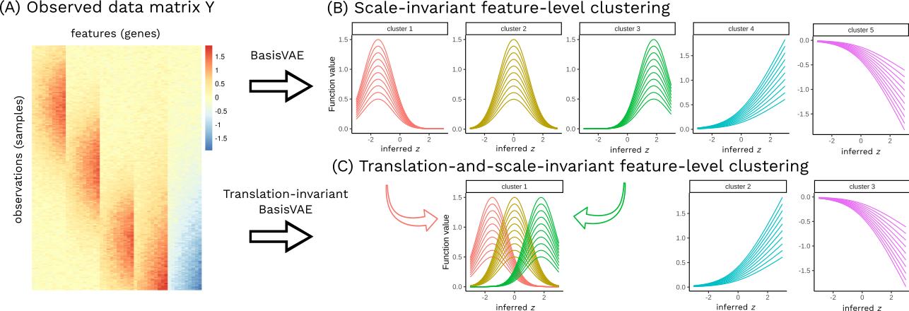

# BasisVAE

This is our PyTorch implementation of our AISTATS 2020 paper **BasisVAE: Translation-invariant feature-level clustering with Variational Autoencoders**



### Demo notebook

See [this Colab notebook](https://colab.research.google.com/drive/1q8rp3k4aAzog3rhsF2at76wysMSqddO5) for a toy example demo. 

### Installation

```
pip install git+https://github.com/kasparmartens/BasisVAE.git
```
